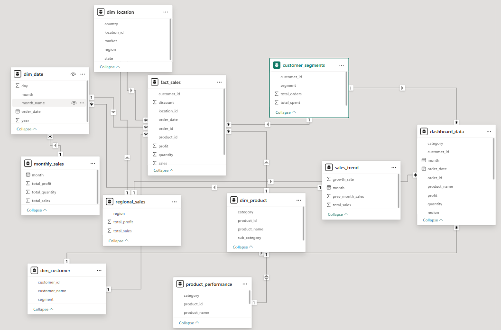
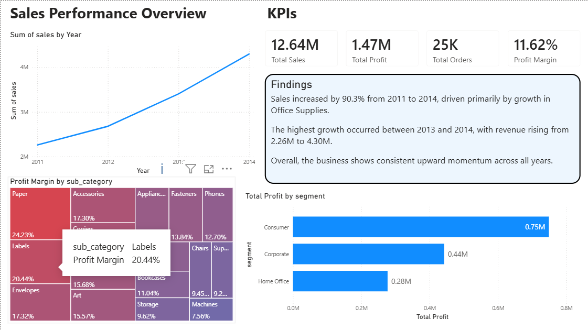
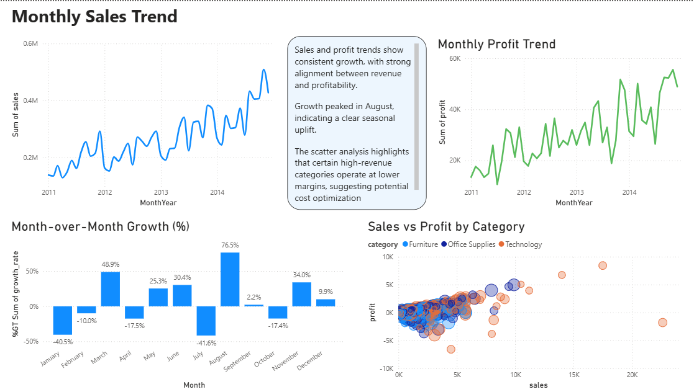

# Retail Sales Analytics Platform using BigQuery & Power BI

## Project Overview

This project presents an end-to-end analytics solution built on **Google BigQuery** and **Power BI** to analyze retail sales performance, customer behavior, and product profitability.

The system integrates data modeling, SQL-based transformations, and interactive dashboarding to deliver actionable business insights.

---

## Architecture

Raw Data → Data Cleaning → Enrichment → Star Schema (Fact & Dimension Tables) → Analytics Layer → Power BI Dashboard

### Star Schema and Analytics data model

---

## Tech Stack

- Google BigQuery (Data Warehouse)
- SQL (Data Modeling & Transformations)
- Power BI (Visualization & Dashboarding)
- Python (optional – for data ingestion/processing)
---

## Key Features

- - Designed star schema with fact and dimension tables for scalable analytics
- Implemented partitioning and clustering in BigQuery for optimized query performance
- Built analytics layer tables for business-ready insights
- Developed interactive Power BI dashboard with KPI tracking, growth analysis, and segmentation
- Integrated time-series forecasting using Power BI
---

## Dashboard Highlights

### 1️. Sales Performance Overview

- KPI tracking (Revenue, Profit, Orders, Margin)
- Trend analysis
- Segment and category insights
- Business findings summary

---

### 2️. Growth & Trend Analysis

- Monthly sales and profit trends
- Month-over-month growth analysis
- Sales vs profit relationship (scatter analysis)

---

## Key Insights

- Sales increased by over 90% between 2011 and 2014
- Consumer segment contributes the highest share of revenue
- Certain high-revenue categories operate at lower margins
- Seasonal peaks indicate potential demand-driven opportunities

---

## Dashboard Preview
###  Sales Performance Overview Page

### Growth & Trend Analysis Page

